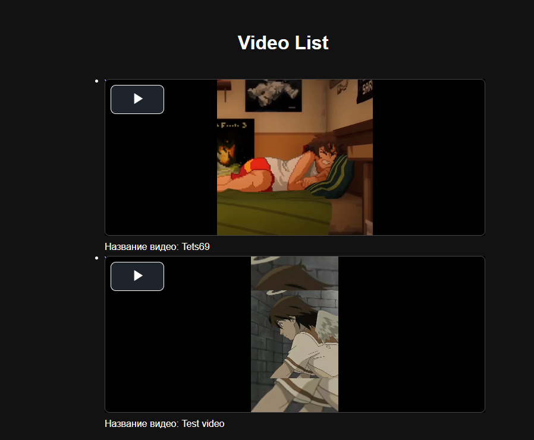
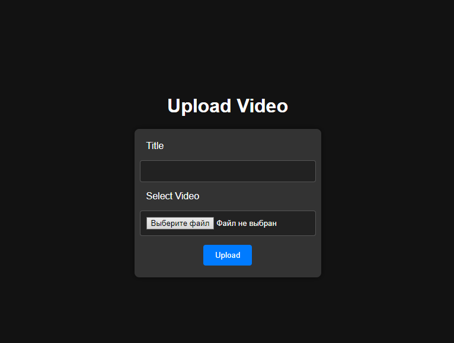

# Приложение для стриминга видео на Django с использованием HLS

## Обзор проекта

Это приложение на Django позволяет пользователям загружать и просматривать видео. Основная цель проекта — изучение и использование технологии HTTP Live Streaming (HLS) для передачи видео.

## Структура проекта и ключевые пути

- **Главная страница:**
  - URL: `http://localhost/`
  - Описание: Отображает список доступных для просмотра видео.

UI страницы:


- **Страница загрузки:**
  - URL: `http://localhost/upload`
  - Описание: Позволяет пользователям загружать новые видео.

UI страницы:


## Используемые технологии

- **Python:** 3.11
- **Django:** 5.0.6
- **База данных:** PostgreSQL 16

## Установка и настройка

Следуйте этим шагам, чтобы установить и запустить проект на вашем локальном компьютере:

1. **Клонируйте репозиторий:**
   ```bash
   git clone https://github.com/ded2322/video-streaming.git
   cd video-streaming
   ```

2. **Создайте и активируйте виртуальное окружение:**
   ```bash
   python3.11 -m venv venv
   source venv/bin/activate
   ```

3. **Установите зависимости:**
   ```bash
   pip install -r requirements.txt
   ```

4. **Настройте PostgreSQL:**
   - Убедитесь, что PostgreSQL установлен на вашем компьютере.
   - Создайте базу данных и пользователя для проекта.

5. **Настройте параметры базы данных:**
   - Обновите настройки `.env` в `project/.env` с вашими данными для подключения к базе данных:
     ```text
     DEBUG=True
     DB_NAME=ваша бд
     DB_USER=postgres
     DB_PASS=postgres
     DB_HOST=localhost
     DB_PORT=5432
     ```

6. **Примените миграции базы данных:**
   ```bash
   python manage.py migrate
   ```

7. **Запустите сервер разработки:**
   ```bash
   python manage.py runserver
   ```

   Теперь приложение должно работать по адресу `http://localhost:8000/`.

## Использование

1. **Доступ к главной странице:**
   - Откройте браузер и перейдите по адресу `http://localhost:8000/` для просмотра списка доступных видео.

2. **Загрузка видео:**
   - Перейдите по адресу `http://localhost:8000/upload` для загрузки нового видео.

## Вклад в проект

Если вы хотите внести свой вклад в этот проект, пожалуйста, следуйте этим шагам:

1. Форкните репозиторий.
2. Создайте новую ветку (`git checkout -b feature-branch`).
3. Зафиксируйте изменения (`git commit -am 'Добавить новую функцию'`).
4. Отправьте изменения в репозиторий (`git push origin feature-branch`).
5. Создайте новый Pull Request.


## Контакты

Если у вас есть вопросы или вам нужна дополнительная помощь, не стесняйтесь открыть issue на GitHub

---

Следуя указанным выше шагам, вы сможете установить и запустить приложение для стриминга видео на Django с использованием HLS на вашем локальном компьютере. Приятного просмотра и загрузки видео!